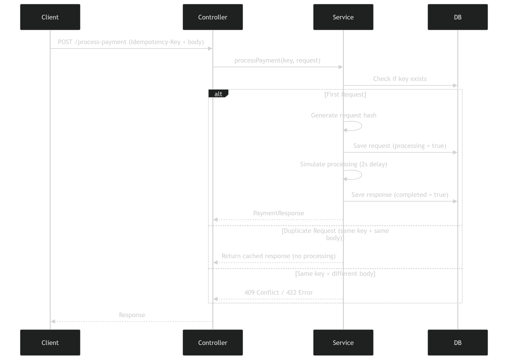

# Idempotency Gateway (Pay-Once Payment System)

## Overview

The Idempotency Gateway is a Spring Boot REST API designed to prevent double payment processing in distributed systems. It ensures that a payment request is processed exactly once, even if the client retries the request multiple times due to network failures or other transient issues.

---

## Problem Statement

In distributed payment systems, network timeouts can cause clients to resend the same request. Without idempotent design, this can lead to:

- Duplicate charges to customers
- Data inconsistency across services
- Financial discrepancies
- Loss of customer trust

This system addresses these challenges using an Idempotency-Key mechanism.

---

## Architecture



---

## Tech Stack

- **Java 17**
- **Spring Boot**
- **Spring Web**
- **Spring Data JPA**
- **Hibernate**
- **PostgreSQL**
- **Maven**

---

## Getting Started

### 1. Clone the Repository
```bash
git clone <your-repo-url>
cd IdempotencyGateway
```

### 2. Configure Environment Variables
Ensure the following environment variables are set in your execution environment:

- `DB_URL`: `jdbc:postgresql://localhost:5432/idempotency_gateway`
- `DB_USERNAME`: `postgres`
- `DB_PASSWORD`: `your_password`

### 3. Build and Run
```bash
mvn spring-boot:run
```
The application will be available at `http://localhost:8080`.

---

## API Documentation

### Endpoint: Process Payment
`POST /process-payment`

#### Headers
- `Idempotency-Key`: A unique identifier for the request.
- `Content-Type`: `application/json`

#### Request Body
```json
{
  "amount": 100,
  "currency": "GHS"
}
```

#### Responses

**Successful Response (First Request)**
```json
{
  "message": "Charged 100 GHS",
  "status": "SUCCESS"
}
```

**Duplicate Request (Same Idempotency-Key)**
The system detects the duplicate key and returns the cached response without re-processing.
Header: `X-Cache-Hit: true`

**Conflict (Same Key, Different Body)**
If an existing key is used with a different request body, a conflict error is returned to prevent tampering.
- **Status Code:** 409 Conflict
```json
{
  "error": "Idempotency key already used for a different request body"
}
```

---

## Design Decisions

- **SHA-256 Hashing:** Used to validate request integrity and ensure the same Idempotency-Key isn't reused with modified request data.
- **Concurrent Management:** Handles in-flight requests safely to prevent race conditions during simultaneous retries.
- **Database Persistence:** Ensures idempotency state is maintained across server restarts.
- **Asynchronous Processing:** Utilizes `CompletableFuture` (or similar mechanisms) to manage processing states effectively.

---

## Key Features

- Prevents duplicate payment processing.
- Ensures retry-safety for API consumers.
- Detects and handles duplicate requests based on unique keys.
- Protects against payload tampering via request hashing.
- Manages race conditions in high-concurrency environments.

---

## Author

Developed as a backend engineering solution focusing on distributed systems reliability.

---

## Operational Notes

- Ensure PostgreSQL is active and accessible before starting the application.
- Verify that environment variables are correctly configured.
- Avoid hardcoding sensitive credentials in the source code.
